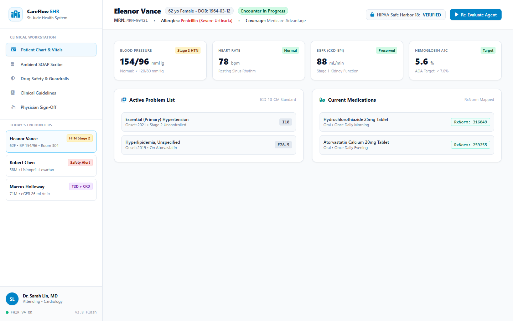
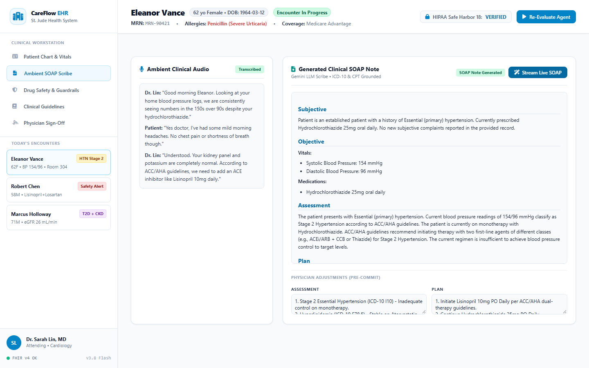
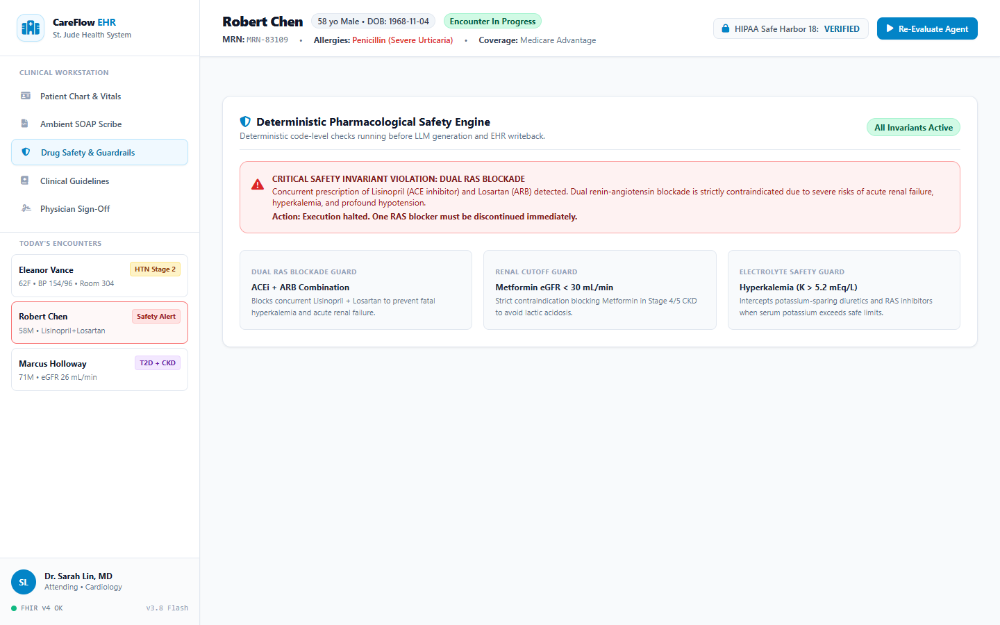
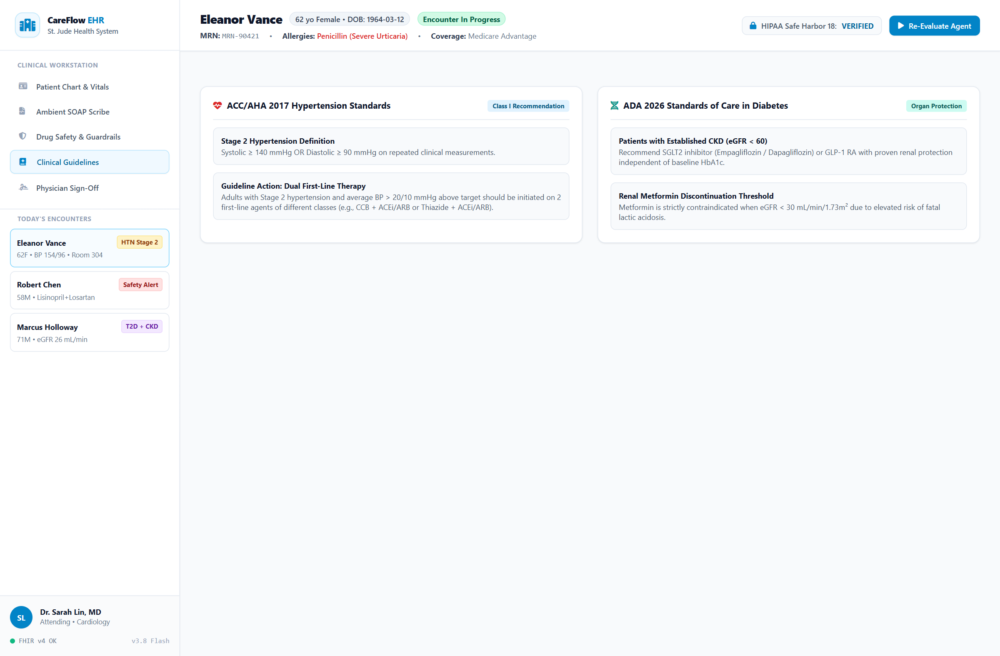
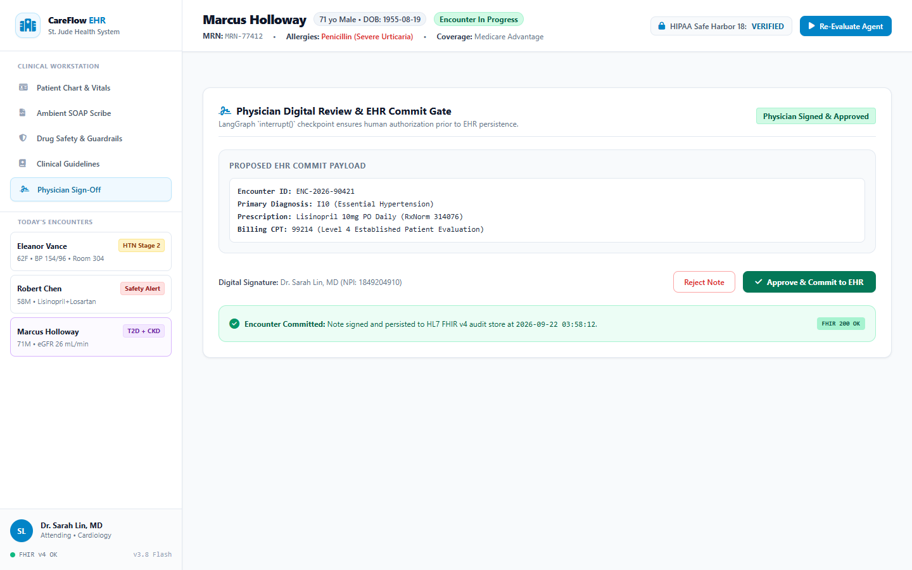

# CareFlow Clinical Agent (EHR & Clinical Decision Support Platform)

[](https://github.com/varadganjoo/careflow-clinical-agent/actions/workflows/ci.yml)
[](https://www.python.org/downloads/)
[](https://modelcontextprotocol.io/)
[](docs/ARCHITECTURE.md)
[](LICENSE)

A clinical decision support and EHR documentation service built with **Gemini 3.6 Flash**, a **Model Context Protocol (MCP)** server, and a durable **LangGraph state machine** featuring **Human-in-the-Loop (HITL)** physician verification.

Designed to assist ambulatory clinicians with ambient SOAP note generation while enforcing deterministic safety invariants (drug-drug interaction blocking, renal contraindications, and HIPAA Safe Harbor 18 de-identification).

> 📄 **System Architecture**: For technical implementation details, safety invariant proofs, and data flow specifications, see [docs/ARCHITECTURE.md](docs/ARCHITECTURE.md).

---

## Visual Walkthrough & Clinical Workstation

A clean clinical workstation designed for ambulatory and hospital workflows: structured vitals grids, tabular lab panels, and an ambient SOAP documentation studio.

### 1. Patient Chart & Longitudinal Vitals
The Patient Chart page presents clean FHIR v4 resource aggregation: active conditions (ICD-10 `I10`), medication lists with RxNorm codes, and longitudinal vitals with normal reference ranges.



---

### 2. Clinical Scribe & SOAP Studio
The ambient scribing studio extracts structured Subjective, Objective, Assessment, and Plan (SOAP) notes from doctor-patient dialogue in real-time, automatically mapping diagnoses to ICD-10 and CPT billing codes.



---

### 3. Drug Safety & Interaction Guardrails
Deterministic safety invariants physically inspect all active medications and lab thresholds. Unsafe combinations (such as concurrent Lisinopril + Losartan dual RAS blockade or Metformin with eGFR < 30) trigger high-visibility critical alerts and halt execution.



---

### 4. Clinical Practice Guidelines (ACC/AHA & ADA)
Displays authoritative clinical practice guidelines directly alongside patient metrics, showing stage classification (e.g., ACC/AHA 2017 Stage 2 Hypertension for SBP ≥ 140) and evidence-based first-line therapy recommendations.



---

### 5. Physician Review & Audit Trail (LangGraph HITL)
Enforces a strict Human-in-the-Loop review gate using LangGraph's `interrupt()`. Physicians can inspect proposed orders, make edits, and digitally sign off before committing encrypted notes to the EHR audit log.



---

## Key Benefits & Clinical ROI

| Benefit Area | Clinical & Business Impact |
| :--- | :--- |
| **Documentation Burden** | **Reduces daily EHR charting time by up to 35%**, generating accurate, structured SOAP notes in seconds. |
| **Patient Safety** | **Zero hallucinated prescriptions**: Deterministic code checks physically intercept drug interactions and renal cutoffs before model generation. |
| **HIPAA Compliance** | **Zero PHI leakage**: Built-in Safe Harbor 18 vault de-identifies all 18 patient identifiers before any cloud API call. |
| **Interoperability** | **Turnkey EHR integration**: Built on standard **HL7 FHIR v4** schemas and **MCP** for connectivity with clinical systems and AI desktop hosts. |
| **Billing Accuracy** | **Automated Coding**: Accurately suggests compliant ICD-10 diagnosis codes (e.g. `I10`, `E11.9`) and CPT evaluation codes (`99214`). |

---

## Architecture Overview

```mermaid
flowchart TD
    subgraph ClientLayer["1. Client & Integration Layer"]
        PhysicianUI["Physician Portal (FastAPI + Dark SaaS UI)"]
        ExternalHost["MCP Hosts (Claude Desktop / Cursor / Hospital EHR)"]
    end

    subgraph MCPLayer["2. Model Context Protocol (MCP) Server"]
        MCP_R["Resources: fhir://patients/{id}, fhir://guidelines/{topic}"]
        MCP_T["Tools: check_drug_interactions, query_guidelines, generate_soap"]
        MCP_P["Prompts: clinical_consultation, discharge_summary"]
    end

    subgraph StateMachine["3. LangGraph Durable State Machine"]
        IngestNode["1. Ingest & Triage Node<br/>(FHIR v4 Standard)"]
        DeIDNode["2. HIPAA PHI De-ID Vault<br/>(Safe Harbor 18 Tokenizer)"]
        SkillNode["3. Clinical Skills RAG<br/>(ACC/AHA & ADA Guidelines)"]
        SafetyNode["4. Deterministic Safety Guard<br/>(Drug-Drug & Lab Thresholds)"]
        ScribeNode["5. SOAP Scribe & ICD-10 Coding<br/>(Gemini 3.6 Flash)"]
        PauseNode["6. Physician Review Gate<br/>(interrupt() Checkpoint)"]
        WritebackNode["7. EHR Writeback Node<br/>(Command(resume) Commit)"]
    end

    subgraph HITL["4. Physician-in-the-Loop Control Plane"]
        ReviewQueue["Physician Review Queue"]
        PhysicianAction["Actions: Approve-as-Is / Edit-before-Execute / Reject"]
    end

    PhysicianUI <-->|HTTP / JSON| StateMachine
    ExternalHost <-->|STDIO / SSE| MCPLayer
    MCPLayer <--> StateMachine

    IngestNode --> DeIDNode --> SkillNode --> SafetyNode --> ScribeNode --> PauseNode
    PauseNode -.->|interrupt() pauses graph| ReviewQueue
    ReviewQueue --> PhysicianAction
    PhysicianAction -.->|Command(resume)| WritebackNode
```

---

## Core Engineering Invariants & Guarantees

1. **Human-in-the-Loop (HITL) Gate (`interrupt` & `Command`)**:
   - The LangGraph state machine **physically pauses** at the `physician_gate` node before any recommendation can be finalized.
   - The physician can **Approve-as-Is**, **Edit-before-Execute** (e.g. adjust medication dosage), or **Reject**. Resumption occurs via `Command(resume=...)`. Zero clinical notes are committed without explicit physician sign-off.
2. **Deterministic Clinical Safety Invariants**:
   - Hardcoded clinical rules intercept dangerous drug combinations before LLM generation:
     - **Dual RAS Blockade**: ACE inhibitor (Lisinopril) + ARB (Losartan) is flagged as `CRITICAL` and blocked.
     - **Metformin Renal Cutoff**: Metformin is strictly blocked if eGFR < 30 mL/min/1.73m² (lactic acidosis risk).
     - **Hyperkalemia Alert**: Serum Potassium >= 5.5 mEq/L triggers an urgent warning.
3. **HIPAA Safe Harbor 18 De-identification Vault**:
   - Automatically masks names, MRNs, phone numbers, emails, addresses, and SSNs with bidirectional tokens (e.g. `[PATIENT_NAME_1]`, `[MRN_1]`) before external model calls, re-hydrating values for local clinical display.
4. **Model Context Protocol (MCP) Server**:
   - Exposes FHIR records as passive resources (`fhir://patients/{id}`) and clinical decision functions as tools (`check_drug_interactions`, `query_clinical_guidelines`, `evaluate_patient_safety`).
   - Supports both **STDIO** (for local agent desktop use) and **HTTP/SSE** (for remote microservices).
5. **Powered by Gemini 3.6 Flash**:
   - Uses `gemini-3.6-flash` by default (override with `GEMINI_MODEL`) via the unified `google-genai` SDK with native Pydantic schema validation for SOAP notes and ICD-10 / CPT coding.

---

## Quickstart

### Prerequisites
- Python 3.11+
- Google Gemini API Key:
  ```env
  GEMINI_API_KEY=your_gemini_api_key_here
  ```

### 1. Installation
```powershell
git clone https://github.com/varadganjoo/careflow-clinical-agent.git
cd careflow-clinical-agent
python -m venv .venv
.\.venv\Scripts\activate
pip install -r requirements.txt
cp .env.example .env
```

### 2. Launch Physician Portal
```powershell
python -m uvicorn app.main:app --port 8010 --reload
```
Open your browser at **`http://127.0.0.1:8010`** to access the interactive Physician Portal.

### 3. Connect to Claude Desktop or Cursor (MCP Server)
Add to your `claude_desktop_config.json`:
```json
{
  "mcpServers": {
    "careflow": {
      "command": "python",
      "args": ["-m", "mcp_server.server"],
      "cwd": "D:/Project Workspace/careflow-clinical-agent"
    }
  }
}
```

---

## Automated Test Suite

Run the full automated test suite verifying all 15 clinical invariants, FHIR parsers, HIPAA de-identification, and LangGraph interrupt/resume lifecycles:

```powershell
python -m pytest tests/ -v
```

```
tests/test_fhir.py::test_fhir_bundle_parsing PASSED                      [  6%]
tests/test_fhir.py::test_observation_lookup PASSED                       [ 13%]
tests/test_fhir.py::test_vitals_summary PASSED                           [ 20%]
tests/test_graph.py::test_graph_pauses_at_physician_review_gate PASSED   [ 26%]
tests/test_graph.py::test_graph_resumes_with_physician_approval PASSED   [ 33%]
tests/test_graph.py::test_graph_resumes_with_physician_edit PASSED       [ 40%]
tests/test_mcp.py::test_mcp_check_drug_interactions PASSED               [ 46%]
tests/test_mcp.py::test_mcp_query_guidelines PASSED                      [ 53%]
tests/test_mcp.py::test_mcp_evaluate_patient_safety PASSED               [ 60%]
tests/test_mcp.py::test_mcp_resources PASSED                             [ 66%]
tests/test_phi_vault.py::test_deidentify_masks_hipaa_identifiers PASSED  [ 73%]
tests/test_phi_vault.py::test_rehydrate_restores_original_values PASSED  [ 80%]
tests/test_safety.py::test_blocks_dual_ras_blockade PASSED               [ 86%]
tests/test_safety.py::test_blocks_metformin_in_severe_ckd PASSED         [ 93%]
tests/test_safety.py::test_detects_hyperkalemia PASSED                   [100%]

============================= 15 passed in 1.16s ==============================
```

---

## Engineering Attribution & AI Pair-Programming

This repository was developed with Gemini and Claude as AI pair-programming assistants. I designed the architecture, the clinical guidelines and deterministic safety rules, and the verification test suites, and reviewed all code.

---

## License
Apache 2.0

