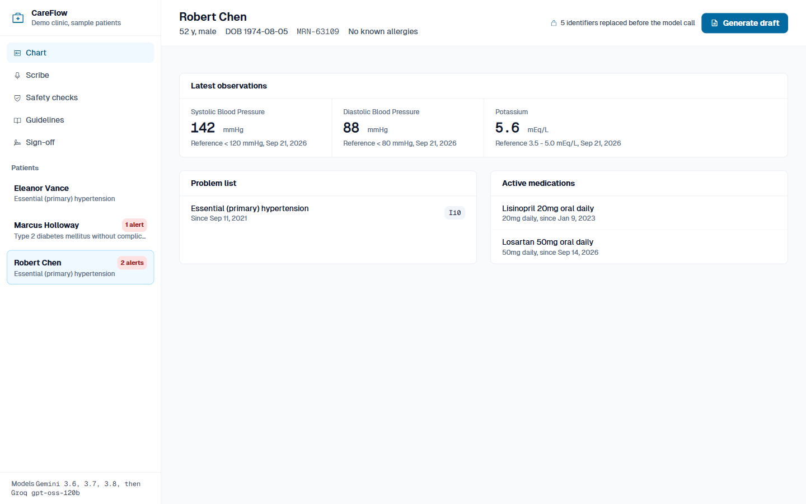
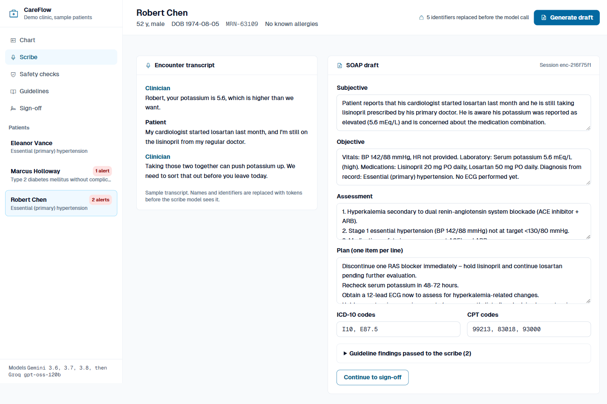
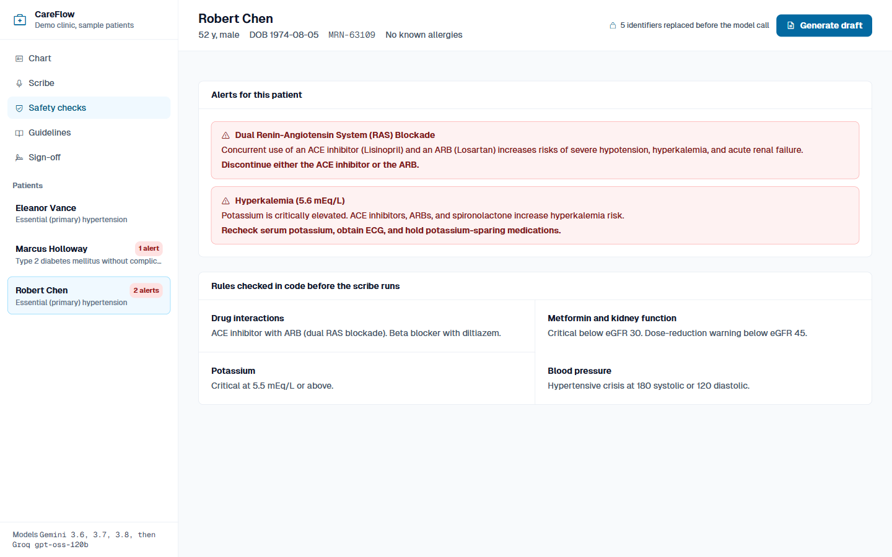
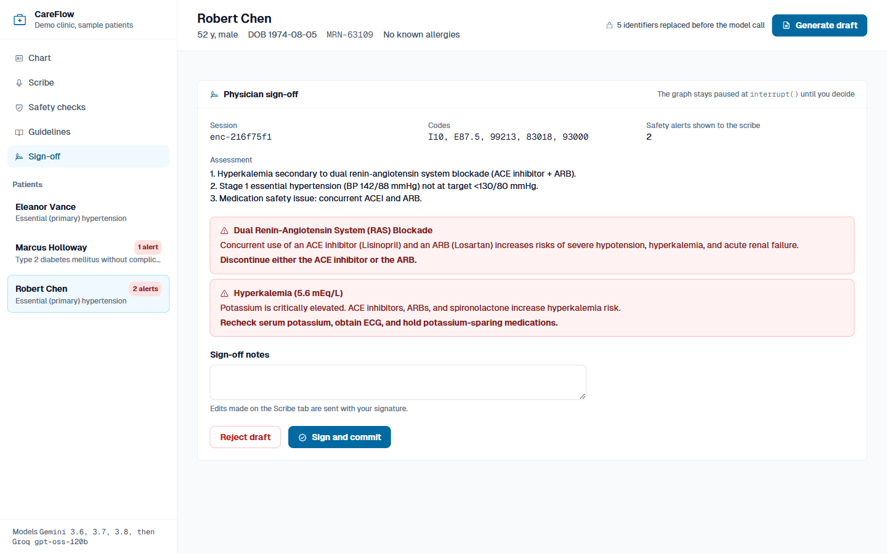

# CareFlow Architecture: Clinical Decision Support & EHR Scribing Service

**Status:** Implemented  
**Author:** Varad Ganjoo  
**Date:** September 2026  
**Repository:** [github.com/varadganjoo/careflow-clinical-agent](https://github.com/varadganjoo/careflow-clinical-agent)

---

## 1. System Overview

Clinical documentation overhead is a primary driver of physician burnout, with ambulatory clinicians spending significant daily time navigating Electronic Health Record (EHR) interfaces and drafting clinical encounter notes. While Large Language Models (LLMs) provide strong summarization capabilities, deploying unconstrained generative models in clinical settings introduces patient safety risks, such as hallucinated pharmacotherapy, failure to intercept drug-drug contraindications, and potential disclosure of Protected Health Information (PHI).

**CareFlow** addresses these challenges by separating probabilistic generation from deterministic safety and governance:
1. **Clinical Reasoning & Scribing**: Uses Gemini 3.6 Flash to extract structured SOAP (Subjective, Objective, Assessment, Plan) notes and map diagnosis codes (ICD-10) and billing codes (CPT).
2. **Deterministic Safety Invariants**: Code-level validation rules that physically intercept dangerous drug-drug interactions (e.g. dual RAS blockade) and organ-function contraindications (e.g. Metformin in advanced CKD) prior to model generation and EHR persistence.
3. **HIPAA Safe Harbor 18 De-Identification**: Bidirectional tokenizer that strips all 18 HIPAA identifiers before external model calls and rehydrates verified text locally.
4. **Human-in-the-Loop (HITL) Review Gate**: Built on LangGraph state machines with durable checkpoints, ensuring no clinical note or order is committed to the EHR without explicit physician review and digital sign-off.
5. **Standards-Based Interoperability**: Consumes and emits HL7 FHIR v4 bundles and implements a Model Context Protocol (MCP) server for integration with clinical desktop tools.

---

## 2. Architecture Layers

```mermaid
flowchart TD
    subgraph ClientLayer["1. Client & Integration Layer"]
        UI["Physician Portal (FastAPI + Tailwind)"]
        ExternalHost["MCP Hosts (Claude Desktop, SMART-on-FHIR)"]
    end

    subgraph MCPLayer["2. Model Context Protocol (MCP) Server"]
        MCP_R["Resources: fhir://patients/{id}, fhir://guidelines/{topic}"]
        MCP_T["Tools: check_drug_interactions, query_guidelines, generate_soap"]
        MCP_P["Prompts: clinical_consultation, discharge_summary"]
    end

    subgraph StateMachine["3. LangGraph Durable State Machine"]
        Ingest["1. Ingest & Triage Node (FHIR v4)"]
        DeID["2. HIPAA PHI De-ID Vault (Safe Harbor 18)"]
        Skills["3. Clinical Skills RAG (ACC/AHA & ADA)"]
        Safety["4. Deterministic Safety Guard (Code Invariants)"]
        Scribe["5. SOAP Scribe & ICD-10 Coding (Gemini 3.6 Flash)"]
        Gate["6. Physician Review Gate (interrupt() Checkpoint)"]
        Writeback["7. EHR Writeback Node (Command(resume))"]
    end

    subgraph HITL["4. Physician-in-the-Loop Control Plane"]
        Queue["Physician Review Queue"]
        Action["Actions: Approve / Edit / Reject"]
    end

    UI <-->|HTTP / JSON| StateMachine
    ExternalHost <-->|STDIO / SSE| MCPLayer
    MCPLayer <--> StateMachine

    Ingest --> DeID --> Skills --> Safety --> Scribe --> Gate
    Gate -.->|interrupt() pauses graph| Queue
    Queue --> Action
    Action -.->|Command(resume)| Writeback
```

### 2.1 FHIR v4 Integration Layer
CareFlow natively consumes and emits **HL7 FHIR v4** compliant JSON bundles (`Patient`, `Condition`, `Observation`, `MedicationRequest`, `AllergyIntolerance`). This enables compatibility with hospital integration engines and SMART-on-FHIR endpoints.

### 2.2 Model Context Protocol (MCP) Implementation
CareFlow implements an MCP server exposing three core primitives:
* **Resources**:
  * `fhir://patients/{id}`: Returns the complete clinical bundle for on-demand context retrieval.
  * `fhir://guidelines/{topic}`: Exposes clinical practice guidelines as read-only markdown context.
* **Tools**:
  * `check_drug_interactions(drugs: list[str])`: Deterministic drug interaction evaluation.
  * `query_clinical_guidelines(condition, sbp, dbp, hba1c, egfr)`: Parameterized guideline lookups.
  * `evaluate_patient_safety(patient_id)`: Holistic bundle safety audit.
  * `generate_clinical_soap(patient_id, encounter_notes)`: Structured SOAP generation.
* **Prompts**:
  * `clinical_consultation`: Standardized prompt template for multi-turn specialist consults.

---

## 3. Deterministic Safety Invariants

Unlike architectures that rely solely on system prompt instructions to avoid contraindications, CareFlow enforces safety rules **in deterministic code** before and after LLM execution.

```
                    ┌───────────────────────────────┐
                    │   FHIR Bundle & Prescriptions │
                    └───────────────┬───────────────┘
                                    │
                                    ▼
                    ┌───────────────────────────────┐
                    │ Deterministic Safety Evaluator│
                    │      (app/safety.py)          │
                    └───────┬───────────────┬───────┘
                            │               │
            [CRITICAL Alert Triggered]   [All Checks Pass]
                            │               │
                            ▼               ▼
                ┌───────────────────┐   ┌───────────────────┐
                │ Hard UI Warning & │   │ Proceed to Scribe │
                │ Invariant Block   │   │ & Recommendations │
                └───────────────────┘   └───────────────────┘
```

### 3.1 Dual Renin-Angiotensin System (RAS) Blockade
Concurrent administration of an ACE inhibitor (e.g., Lisinopril) and an Angiotensin Receptor Blocker (e.g., Losartan) provides no additive cardiovascular benefit while significantly increasing risks of hyperkalemia, profound hypotension, and acute renal impairment. CareFlow intercepts this pair deterministically:
$$\text{Alert}(\text{Severity}=\text{CRITICAL}) \iff (\text{ACEi} \in \text{Meds}) \land (\text{ARB} \in \text{Meds})$$

### 3.2 Renal Function Contraindications (Metformin & CKD)
Per ADA Standards of Care, Metformin is contraindicated in patients with advanced renal impairment ($eGFR < 30\,\text{mL/min}/1.73\,\text{m}^2$) due to elevated risk of lactic acidosis. The safety evaluator checks:
$$\text{Contraindicated}(\text{Metformin}) \iff \text{eGFR} < 30\,\text{mL/min}/1.73\,\text{m}^2$$

---

## 4. Human-in-the-Loop Governance via LangGraph

CareFlow enforces human clinical sign-off using LangGraph's durable execution checkpointing:

1. The graph executes through ingestion, de-identification, clinical guideline retrieval, deterministic safety verification, and draft SOAP generation.
2. At the `physician_review_gate` node, execution pauses via `interrupt()`:
   ```python
   # app/graph.py
   def review_gate_node(state: ClinicalState) -> dict:
       decision = interrupt({
           "type": "physician_review_required",
           "patient_id": state["patient_id"],
           "draft_soap": state["draft_soap"],
           "suggested_codes": state["suggested_codes"],
           "safety_alerts": state["safety_alerts"]
       })
       return {"physician_decision": decision}
   ```
3. The physician reviews the note, optionally edits dosages or clinical findings, and approves or rejects the record.
4. Resumption occurs via `Command(resume=...)`, committing the final signed payload to the audit log.

---

## 5. Clinical Workstation Interface & Telemetry

CareFlow provides a structured clinical workstation designed for ambulatory and hospital workflows:

1. **Patient Chart**:


2. **Clinical Scribe & SOAP Studio**:


3. **Drug Safety & Interaction Guardrails**:


4. **Clinical Guidelines (ACC/AHA & ADA)**:

5. **Physician Sign-off**:


---

## 6. Verification & Automated Test Suite

CareFlow is covered by an automated test suite (`tests/`):
- **FHIR Parsing**: Validates parsing of Patient, Observation, Condition, and MedicationRequest resources.
- **HIPAA PHI Vault**: Tests 18-identifier masking and exact string rehydration round-trips.
- **Safety Invariants**: Tests deterministic detection of dual RAS blockade, Metformin CKD cutoffs, and hyperkalemia alerts.
- **State Machine HITL**: Tests graph pausing at `interrupt()` and state resumption upon physician approval.
- **MCP Protocol**: Tests resource URI resolution, tool execution, and prompt templates.

---

## References

1. Google. *Gemini API documentation*. https://ai.google.dev/gemini-api/docs
2. Model Context Protocol. *Specification*. https://modelcontextprotocol.io
3. LangChain. *LangGraph* (persistence, `interrupt()` and human-in-the-loop). https://github.com/langchain-ai/langgraph
4. HL7 International. (2019). *FHIR Release 4*. https://hl7.org/fhir/R4/
5. Whelton, P. K., et al. (2018). 2017 ACC/AHA/AAPA/ABC/ACPM/AGS/APhA/ASH/ASPC/NMA/PCNA Guideline for the Prevention, Detection, Evaluation, and Management of High Blood Pressure in Adults. *Hypertension*, 71(6), e13-e115.
6. American Diabetes Association. *Standards of Care in Diabetes* (published annually as a supplement to *Diabetes Care*). https://diabetesjournals.org/care
